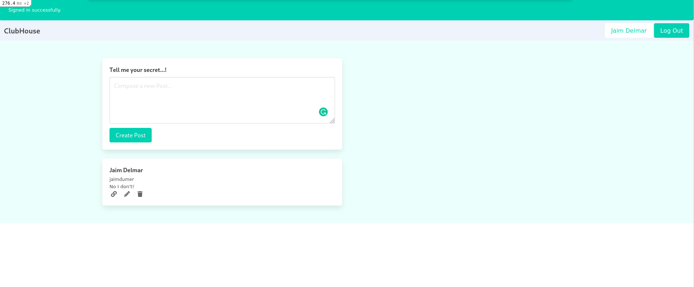

# Club House Social Media

A social media to tell secrets... shhhh...



## Built With

- Ruby 3.0.0
- Rails 6.1.3
- Bundle 2.2.2
- Devise 4.7.4
- Bulma-Rails 0.9.1
- Better Errors 2.9.1
- Rubocop 1.9

## Getting Started

Follow these simple steps to get started:

### Prerequisites

- Ruby 3.0.0
- Rails 6.1.3
- A terminal

### Set up

To get a local copy of this repository enter the following command in you terminal:

```
git clone https://github.com/abdulkhaliqdev/clubhouse
```

Or download this repository and unzip it.

### Installation

- From the project's root directory execute 'bundle install' to install the necessary gems:

```
bundle install
```

- Then run yarn to install all the node dependancies:

```
yarn
```

- Make a migration of the database:

```
rails db:migrate
```

### Usage

- In the project's root directory execute the 'rails server' command:

```
rails s
```

- Open in your browser

```
http://127.0.0.1:3000
```

- Sign up to create, edit or delete posts.

## Authors

👨‍💻 **Jaim Delmar**

- Github: [@jadx2](https://github.com/jadx2/)
- Twitter: [@bash0zen](https://twitter.com/bash0zen)
- LinkedIn: [@Jaim Delmar](https://www.linkedin.com/in/jaimdelmar/)

👨‍💻 **Abdul Khaliq**

- Github: [@abdulkhaliqdev](https://github.com/abdulkhaliqdev)
- Twitter: [@abdulkhaliqdev](https://twitter.com/Abdulkhaliqdev)
- LinkedIn: [LinkedIn](https://www.linkedin.com/in/abdul-khaliq-89452b1a9/)

## 🤝 Contributing

Contributions, issues, and feature requests are welcome!

Feel free to check the [issues page](https://github.com/abdulkhaliqdev/clubhouse/issues)

## Show your support

Give a ⭐️ if you like this project!

## Acknowledgments

- Microverse
